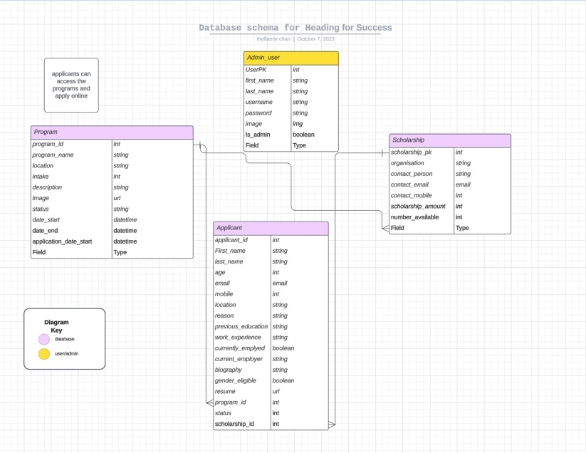

# SheFunds  - Backend

SheFunds was born as a class project for SheCodes cohort of Brisbane 2023.  

The goal of the project is to provide a one-stop-shop for students to browse and apply to programs.  

For admins, to upkeep and maintain a dynamic view of available open programs, review applications and match students with the best scholarship for them.

## Contributors  
* Tracey Nguyen - [https://github.com/trace-n](https://github.com/trace-n)  
* Julie Powell - https://github.com/thellamiechan  
* Cinzia Loi - https://github.com/cinzialoi  

## Features: 
**USERS**  

Type | Access | Role type assignment
--- | --- | ---
*Admin* | All access    | **All SheCodes staff**  
-- | Can log in | --
-- | Can log out | --
-- | Create and manage Programs | --
-- | Create and manage Scholarships | --
-- | Create other users | --
-- | View and manage applications | --
*Applicants* | Can browse open programs | **Public -anyone with link**
-- | Can apply for programs | --
-- | As explicitly requested by PO applications cannot be withdrawn | --

**SCHOLARSHIPS**  

Feature | Access | Note/Condition
--- | --- | ---
*Create, update, view* | Admin    | **User must be logged in**  
*Delete* | Admin | **Must be inactive** 

**APPLICATION**  

Feature | Access | Note/Condition
--- | --- | ---
*Create* | Anyone with a link    |   
*View* | Admin | **Must be logged in** 
*Update* | Admin | **Must be logged in** 
-- | -- | **Can only update specific fields (EG Is_accepted? And Scholarship)** 
*Delete* | Admin | **Must be logged in** 

**STRETCH GOALS**:  

- Dynamic form for new posting programs/questions  
- Profile accessible via login for applicants to update personal info and application.  
- Auto email applicants to let them know the outcome of their application  
- Auto email newly created users with their first-login credentials  
- Matrix to suggest best sponsor for an applicant based on predefined criteria  
- Search criteria for open programs for applicant
- Editing own user profile

## Languages & Frameworks: 

*Back-end:*  
- Django Rest Framework (DRF) API  
- Python  

*Database:*  
- SQLite3  

*Deployment:*  
- Fly.io (backend)  

*Other Tools:*  
- GitHub (code control and collaboration)  
- Insomnia (API testing)

## Database schema  
 
 

## API Specification  

HTTP Method | Url           | Purpose            | Request Body   | Successful Response Code | Authentication / Authorization |  
--- | --- | --- |--- | --- | --- |
GET | /program | Get all programs |None | 200 | Admin |
GET | /scholarship | Get all scholarships |None | 200 | Admin |
GET | /applicant | Get all applicants |None | 200 | Admin |
GET | /program/1 | Return the program with ID of "1" |None | 200 | Admin |
GET | /scholarship/1 | Return the scholarship with ID of "1" |None | 200 | Admin |
GET | /applicant/1 | Return the applicant with ID of "1 |None| 200 | Admin |
GET | /program-open | Get all programs where application_date_end is > today |None | 200 | None |
GET | /user/1 | Return the user with ID of “1” |None | 200 | Must be ID of Logged in Admin User |
POST | /program | Create a new program | {   "program_name": "SheCodes Founder",  "location": "Brisbane", "intake": "September 2023", "description": "Female entrepreneur course for start up", "image": "https://via.placeholder.com/300.jpg", "date_start": "2023-09-01T23:53:30.592856Z", "date_end": "2024-10-31T23:53:30.592856Z", "application_date_start": "2023-07-01T23:53:30.592856Z", "application_date_end": "2023-08-31T23:53:30.592856Z" } | 201 | Admin |
POST | /scholarship | Create a new scholarship |{ "organization": "Latest test", "contact_person": "Test McTesterson", "contact_email": "Blah@test.com", "contact_mobile": "0400000000", "scholarship_amount": "40000", "number_available": "4", "program": "2" } | 201 | Admin |
POST | /applicant | Create a new applicant |--- | 201 | None |
POST | /user | Create a new admin user |{ 	"username": "Test", 	"password": "Welcome@123", 	"first_name": "Cinzia", 	"last_name": "Test", 	"email": "test@test.com", 	"image": "https://via.placeholder.com/300.jpg" } | 201 | Admin |
POST | /api-token-auth | Create authentication for user |--- | 200 | Username and password must be supplied |
PUT | /program/1 | Update the program with ID of "1" |{   "program_name": "SheCodes Founder",  "location": "Brisbane", "intake": "September 2023", "description": "Female entrepreneur course for start up", "image": "https://via.placeholder.com/300.jpg", "date_start": "2023-09-01T23:53:30.592856Z", "date_end": "2024-10-31T23:53:30.592856Z", "application_date_start": "2023-07-01T23:53:30.592856Z", "application_date_end": "2023-08-31T23:53:30.592856Z" } | 200 | Admin |
PUT | /scholarship/1 | Update the scholarship with ID of "1" |{ "organization": "Latest test", "contact_person": "Test McTesterson", "contact_email": "Blah@test.com", "contact_mobile": "0400000000", "scholarship_amount": "40000", "number_available": "4", "program": "2" } | 200 | Admin |
PUT | /applicant/1 | Update the applicant with ID of "1" |--- | 200 | Admin |
PUT | /user/1 | Update the user with ID of "1" |{ 	"username": "Test", 	"password": "Welcome@123", 	"first_name": "Cinzia", 	"last_name": "Test", 	"email": "test@test.com", 	"image": "https://via.placeholder.com/300.jpg" }  | 200 | Admin |
DELETE | /program/1 | Delete the program with ID of "1" |None | 204 | Admin |
DELETE | /scholarship/1 | Delete the scholarship with ID of "1" |None | 204 | Admin |
DELETE | /applicant/1 | Delete the applicant with ID of "1" |None | 204 | Admin |

## Submission Documentation 
Deployed Project: [https://shefunds.fly.dev](https://shefunds.fly.dev "Deployed Backend DRF site") 

## Instructions For Setting Up This Repo

1. Clone the repo down with `git clone https://github.com/SheCodesAus/heading_for_success_backend_bris_2023.git`
2. Create and activate a `venv`
3. Install dependencies with `pip install -r requirements.txt`

